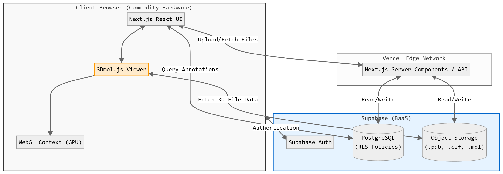
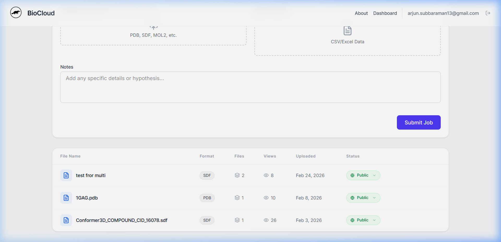
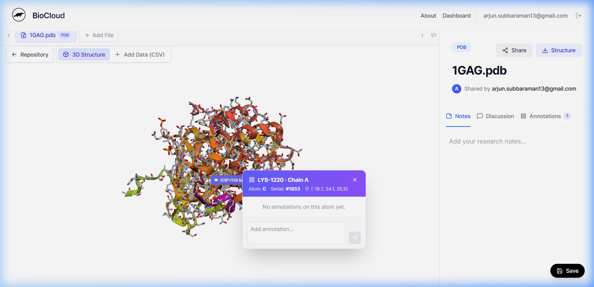
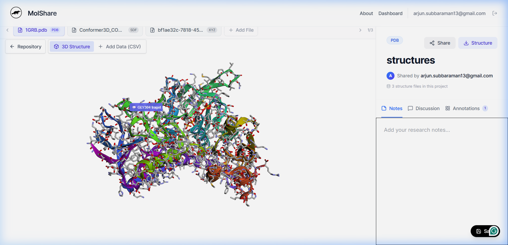

# MolShare: a browser-native platform for collaborative molecular structure visualization and annotation

---

## Abstract

**Motivation:** Structural and computational biologists have been forced into sharing and collecting relevant data using public tools that use raw coordinate files over email or manual workflows, which detach data files. This can lead to version error corrupted data and key communication issues when forwarding the information of target residues for docking studies over text. Furthermore, existing desktop visualizations has complex command-line and file path installations and require high-end hardware that prevents students and researchers with low-end laptops from being  able to preview or even view files without downloading them.

**Result:** Overcoming this, I propose MolShare- A browser based stand alone web application that needs no installation and no dedicated workspace for structural collaboration with their associated tabular data and allows end users to instantly share their work. MolShare supports submission of   multiple 3d structures along with their associated data and allows users to share their resulting 3d environment. The atom-wise annotation functionality builds on molecular structure annotations to allow users to append their remarks directly onto the 3D structure of the target residues. This eliminates the complex discussion completely. All rendering of the 3d states are done on the client side Device, letting the user interact, analyse and explore the molecular state with very low hardware requirements.

**Availability and Implementation:** MolShare is an open-source, freely available under a permissive MIT license. The source code is accessible at https://github.com/messiay/MolShare, and the application is deployed for live use at https://molshare.arjanapartners.in.

---

## 1. Introduction

Looking at the orientation of lysine residue in relation to the target of an enzyme substrate docking, the principles of molecular physics remained completely different to the users. The Three-Dimensional visualization becomes essential when there is a need to comprehend structural specificity, localisation, binding sites and their topology, the mechanics of interaction between the molecules. The task of accurately describing the significant issue of structural biology in the absence of sensory observations is highly inefficient and poses an exponential risk of misunderstanding.

In spite of the necessity of Three-Dimensional visualization, the collaborative structural analysis relies on highly disoriented workflows.  When A Researcher or a student needs to highlight a binding site, the most common way to capture it is to send a two-dimensional static screenshot or images and manually indicate drawing over it or by sending in a standalone .pdb or .pdbqt file via email. This fragmented approach removes the interactive context and the placement burden on the receiver's end to download and use the correct file, ensuring that they have the necessary desktop software installed and manually locate the exact region of interest.

MolShare addresses these structural bottlenecks by unifying interaction, Three-Dimensional visuals, metadata storage, and immediate and direct collaboration into a single shareable web link. Enabling spatially-Anchored, molecule-wise annotation, the platform ensures that all collaborators are viewing the exact same interactive three-dimensional state without requiring any local software installations or specialised computer hardware.

---

## 2. Architecture and Implementation

MolShare employs a new, Serverless web architecture that is designed to eliminate the need for a centralised graphical processing. The System Composed of three primary layers:

### 2.1 Frontend User Interface

The client-side application is developed using the Next.js React framework and hosted on the Vercel Edge Network. This layer serves as the centralised workspace, dealing with user authentication, project routing, and the multi-file carousel interface that enables users to easily switch between different molecular representations.

### 2.2. Backend Data Persistence (Supabase)

File storage and relational data are handled by Supabase. Large coordinate files (.pdb, .cif) and corresponding datasets (.csv) are stored in object storage. A PostgreSQL database is the ledger for the application. Most importantly, when an annotation is created by a user, the database stores the precise Cartesian coordinates (X, Y, Z) of the chosen atom, thus irrevocably associating the user's text note with that particular point in space in the project. Row Level Security (RLS) policies enable the private or safe public sharing of projects through public URLs. Strict Row Level Security policies enforce owner-only write privileges, ensuring that while invited collaborators can interactively view the 3D state and read annotations, only the original project owner can append new spatial data. A dedicated 'Shared With Me' dashboard automatically tracks and routes authenticated users to projects they have been invited to view.

### 2.3. Client-Side Rendering (3Dmol.js)

In order to avoid the computational hurdles associated with server-side rendering, BioCloud employs a stringent form of Client-Side Rendering (CSR). When one accesses a URL for a project, the unrefined structural files are sent directly to the browser. The system then relies on the 3Dmol.js library to tap into the local WebGL context of the user, rendering the molecule directly on the user's machine. This enables one to achieve a smooth framerate even on a student laptop with integrated graphics (Table 1).

---

## 3. Key Collaborative Features

### 3.1. Multi-File and Data Integration

Unlike conventional single-file browsers, BioCloud allows for the simultaneous upload of multiple 3D files and CSV data into a single project. This allows for rapid comparative analysis, such as comparing multiple docked poses or wild-type versus mutant structures within the same browser window.

### 3.2. Spatially-Anchored Annotations

To overcome the "screenshot problem," BioCloud includes an interactive annotation tool. Users can click on any particular atom within the 3D viewer to launch an annotation pop-up. Annotations are stored within the database and displayed as semi-transparent spheres and text labels directly on the 3D molecule. When a collaborator clicks on the shared link, they see the very same highlighted residues immediately, cutting down on potential communication errors by orders of magnitude.

---

## 4. Conclusion

BioCloud democratizes access to structural biology visualisation. By offloading the entire graphical processing task to the client browser and establishing a URL-based, spatially-annotated collaborative workspace, it overcomes the hardware and software obstacles that have traditionally prevented students and early-career researchers from engaging with structural biology visualisation.

---

## Acknowledgements

Artificial intelligence software (Google Gemini, Antigravity) was employed to help with codebase generation, formatting, and structural outlining of this manuscript, as per journal guidelines.

---

## Figure 1 — System Architecture & Data Model

### Panel A: System Architecture

---

### Panel B: Entity-Relationship Diagram (Database)

.png)

---

## Figure 2 — User Interface

### Panel A: Dashboard with Repository & Shared With Me

*The dashboard displays the project repository (top) listing the user's own projects with file counts, view counts, upload dates, and privacy status. Below it, the **Shared With Me** section shows projects that other users have shared with the current user, including the project owner's identity and the date it was last viewed—demonstrating MolShare's real-time collaborative workflow.*

---

### Panel B: Atom Annotation Popup

---

### Panel C: Annotation Markers Rendered on the 3D Structure

---

## Table 1 — Client-Side Rendering Performance

**Test Hardware:** AMD Ryzen (12 cores) / AMD Radeon 740M integrated GPU / 8 GB RAM / Windows 10 / Chrome 145

**Rendering mode:** cartoon + stick (same as MolShare default for proteins). Measurements via `performance.now()` and `requestAnimationFrame` over 5-second rotation intervals.

| PDB ID | Structure                 | Atom Count | File Size (KB) | Render Time (ms) | Re-render / Warm (ms) | Interactive FPS |
|--------|---------------------------|------------|----------------|-------------------|-----------------------|-----------------|
| 4HHB   | Hemoglobin tetramer       | 4,779      | 463            | **460**           | 3.1                   | **21.9**        |
| 1JFF   | Glutamate dehydrogenase   | 6,702      | 587            | **803**           | 5.0                   | **22.7**        |
| 1AON   | GroEL chaperonin          | 58,870     | 4,857          | **1,964**         | 22.5                  | **21.3**        |

**Notes:**
- Render time measures client-side computation only (model parsing + geometry generation + first WebGL draw call), excluding network fetch time.
- Interactive FPS measured during continuous Y-axis rotation via `requestAnimationFrame`.
- All tests performed on integrated graphics — discrete GPU hardware is expected to yield higher frame rates.
